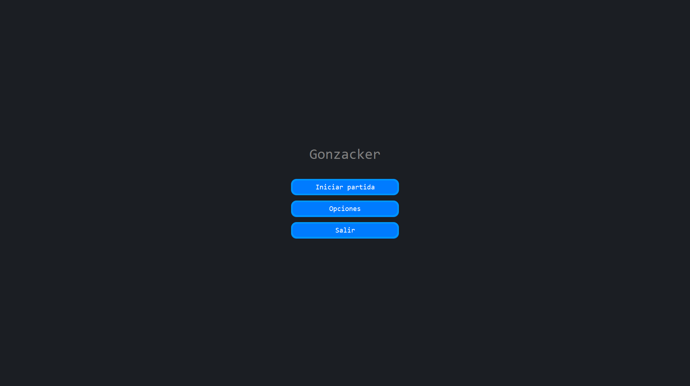
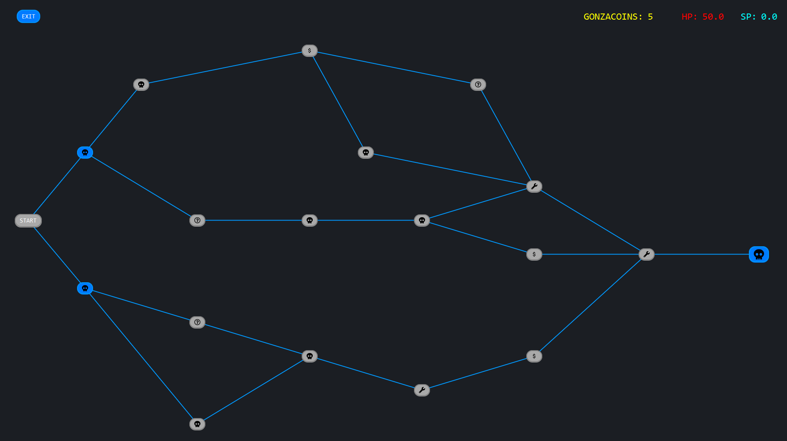

# Gonzacker
Juego de creación de mazos de estilo de roguelike de combate con el objetivo de acabar con el gran hacker y los bugs en el sistema.

## Miembros
Diego García Hernández  
Haendel Isaac González Zuleta  
Ismael Medina Waló

## Instalación

## Manual de uso
### Menú

En el menú principal se puede seleccionar entre 3 opciones diferentes:
- **Iniciar partida**: inicia la partida.
- **Opciones**: permite cambiar la configuración del juego.
- **Salir**: cierra el juego.

### Partida

Al comenzar una partida veremos el mapa del juego con diferentes nodos.
- **Nodos combate**: los nodos de combate son los que tiene icono de calavera. Tendremos que enfrentarnos a una seria de enemigos y derrotarlos para poder avanzar al siguiente nodo.
- **Nodos evento**: los nodos con un signo de interrogación son eventos que pueden tener diferentes efectos.
- **Nodos tienda**: los nodos con un el símbolo del dólar son tiendas donde podremos comprar cartas usando nuestras *gonzacoins* que hayamos obtenido ganando combates durante los nodos previos o en eventos.  
- **Nodos reparación**: los nodos con un símbolo de llave inglesa son nodos de reparación donde recuperaremos una cierta cantidad de vida.

## Documentación