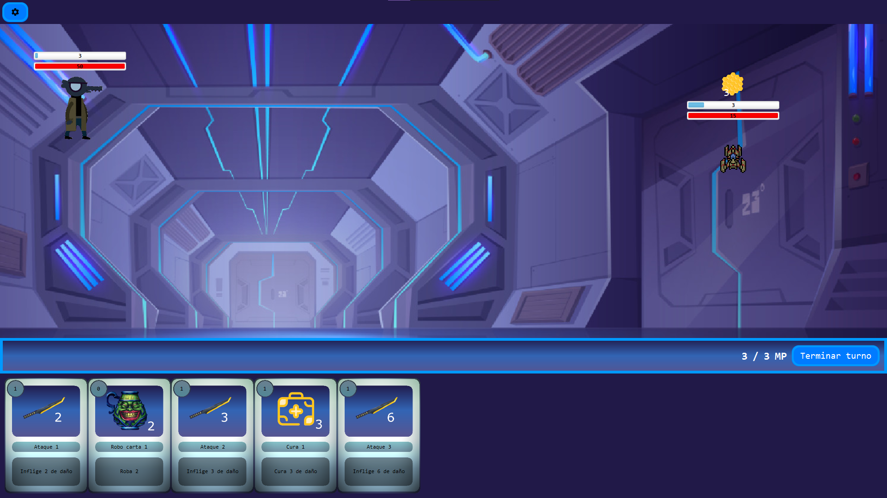
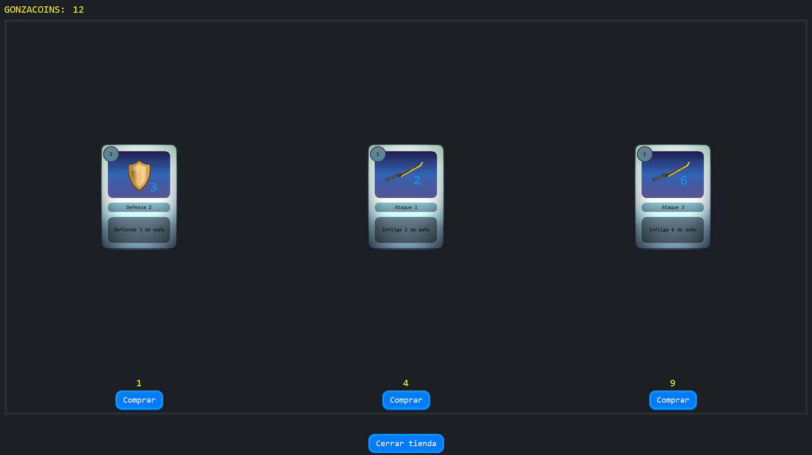
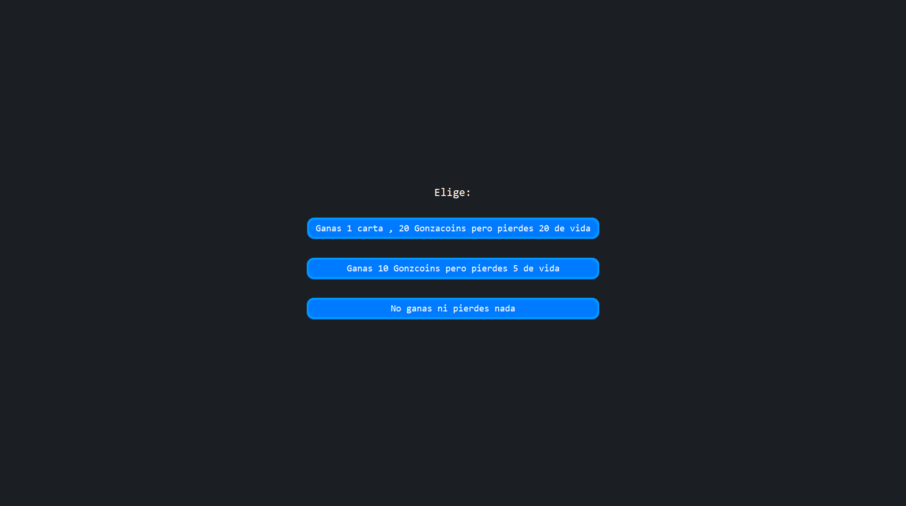

# Gonzacker
Juego de creación de mazos de estilo de roguelike de combate con el objetivo de acabar con el gran hacker y los bugs en el sistema.

## Miembros
Diego García Hernández  
Haendel Isaac González Zuleta  
Ismael Medina Waló

## Instalación
El juego está disponible para **Windows** en versión instalable.

Descarga alguna de las siguentes versiones:

* [Gonzacker v1.0.0]()

## Manual de uso
### Menú

En el menú principal se puede seleccionar entre 3 opciones diferentes:
- **Iniciar partida**: inicia la partida.
- **Opciones**: permite cambiar la configuración del juego.
- **Salir**: cierra el juego.

### Partida

Al comenzar una partida veremos el mapa del juego con diferentes nodos.
- **Nodos combate**: los nodos de combate son los que tiene icono de calavera. Tendremos que enfrentarnos a una seria de enemigos y derrotarlos para poder avanzar al siguiente nodo.
- **Nodos evento**: los nodos con un signo de interrogación son eventos que pueden tener diferentes efectos.
- **Nodos tienda**: los nodos con un el símbolo del dólar son tiendas donde podremos comprar cartas usando nuestras *gonzacoins* que hayamos obtenido ganando combates durante los nodos previos o en eventos.  
- **Nodos reparación**: los nodos con un símbolo de llave inglesa son nodos de reparación donde recuperaremos una cierta cantidad de vida.

### Combate

Al entrar a un nodo de combate nos saldrán nuestras cartas en la parte inferior de la pantalla. En el campo de batalla vemos a nuestro personaje con nuestra vida y escudo en la parte superior izquierda y a nuestro enemigo en la parte superior derecha. Todas las cartas tiene un coste de maná y realizan diferentes acciones. Veremos que al lado del botón de terminar turno tenemos nuestros puntos de maná. Tendremos que manejar nuestro maná para y usar nuestras cartas de manera estratégica para derrotar a los enemigos.

### Tienda

Los nodos tienda permiten comprar cartas con nuestras *gonzacoins*. Podemos ver las cartas que están a la venta, comprarlas y añadirlas a nuestro mazo si queremos.

### Eventos

Los nodos evento pueden tener diferentes efectos. Podrás elegir uno o no seleccionar ninguno y continuar con tu camino.

### Reparación
Los nodos de reparación nos permiten recuperar una cierta cantidad de vida.

## Documentación
El proyecto cuenta con paquetes principales:
* `dad`: contiene los archivos principales del juego.
* `dad.gonzacker.components`: contiene los componentes del juego.
* `dad.gonzacker.controllers`: contiene todos los controladores y la lógica principal del juego.
* `dad.gonzacker.intencionesenemigo`: contiene la lógica de las intenciones de los enemigos.
* `dad.gonzacker.models`: contiene las clases modelo del juego.
* `dad.gonzacker.patronesEnemigo`: contiene la lógica de los patrones de ataque de los enemigos.